# Exercices - TP2

## Rétrospective sur le processus

### Liste de métriques importantes à mesurer

- Combien de temps (moyenne, minimum, maximum) votre équipe prenait-elle pour implémenter une issue?
    - Notre équipe prenait entre 1h et 2h pour implémenter une issue.

- Combien de temps (moyenne, minimum, maximum) votre équipe prenait-elle pour intégrer une pull-request? (review +
  correctifs)
    - Notre équipe prenait entre 1 et 3 jours pour intégrer une pull-request.

- Combien de personnes (moyenne, minimum, maximum) travaillaient sur chaque issue? (individuel, paire, équipe, etc.)
    - Entre 1 et 2 personnes travaillaient sur chaque issue.

- Combien de personnes (moyenne, minimum, maximum) reviewaient chaque pull-request?
    - Entre 1 et 2 personnes *reviewaient* chaque pull-request.

- Combien d'issue (moyenne, minimum, maximum) étaient en cours d'implémentation en même temps?
    - 5 issues (1 par personne) étaient en cours d'implémentation en même temps.

- Combien de pull-requests (moyenne, minimum, maximum) étaient en cours de review en même temps?
    - Une seul pull-request était en cours de review.

### Réflexions

1. Selon vous, est-ce que les issues/pull-requests prenaient trop de temps à être terminées? Ou pas assez? Quel serait
   le temps idéal (approximatif) pour chacun?
    - Les issues identifiées par l’équipe étaient relativement courtes, donc elles ne prenaient donc pas trop de temps à
      être terminées. Ainsi, le temps idéal pour implémenter une issue serait entre 1 et 2 heures, comme c’était le cas
      pour le TP1. Bien que le temps requis pour chacune des issues puisse varier, l’important est que chaque issue soit
      complétée avant la date fixée par l’équipe. Cependant, nous avons remarqué que les pull-requests prenaient trop de
      temps à être approuvées. L’équipe a donc conclu que le temps idéal pour compléter une pull-request serait de 2
      jours, soit une journée pour faire la review et une journée pour apporter les corrections nécessaires.

2. Quel est le lien entre la taille de ces issues/pull-requests et le temps que ça prenait à les terminer?
    - Le lien entre la taille des issues/pull-requests et le temps nécessaire pour les terminer est généralement
      proportionnel. En effet, plus les issues sont importantes, plus elles nécessitent de temps pour effectuer des
      tests et des vérifications, ce qui rallonge le processus de review. Les issues/pull-requests de grande taille
      exigent souvent une implémentation plus complexe et, par le fait même, une révision plus approfondie, ce qui
      entraine un délai plus long pour les compléter. Il est donc important d’avoir des issues de taille raisonnable
      afin de pouvoir compléter les issues/pull-requests dans un délai idéal.

3. Donnez au moins 3 trucs pour améliorer votre processus (tailles des issues/pr, communication, code reviews,
   uniformisation, etc.)
    - Il faut réduire les délais de review des pull-requests
    - Il faut faire des tests plus exhaustifs avant de faire une pull-request
    - Il faut faire attention pour mieux respecter les balises mises en place pour l’uniformisation du code et des
      conventions

## Architecture

  
Diagramme

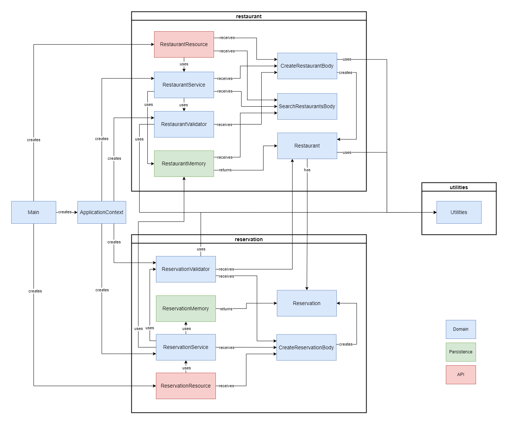

### Rôles des classes principales

La classe _RestaurantResource_ permet de faire la gestion des restaurants dans la couche API. Plus précisément, elle
permet de créer un restaurant, d’obtenir un restaurant ou une liste des restaurants et d’effectuer une recherche de
restaurants. Pour ce faire, elle fait appel à la classe _RestaurantService_, qui permet d’exécuter les différentes
actions
liées à la gestion des restaurants. À son tour, la classe _RestaurantService_ utilise deux autres classes, soit
_RestaurantValidator_ pour la validation des informations lors de la création d’un restaurant et _RestaurantMemory_ pour
l’enregistrement des restaurants et la réalisation des opérations associées aux restaurants. Pour ce qui est de la
classe _ReservationResource_, elle s’occupe de la gestion des réservations, incluant la création de nouvelles
réservations
pour un restaurant spécifique et la récupération des détails d’une réservation. Sa structure est similaire à
_RestaurantResource_. En effet, elle dépend de deux classes, soit _ReservationValidator_ et _ReservationMemory_ qui ont
les
mêmes rôles que RestaurantValidator et RestaurantMemory, mais pour les opérations liées aux réservations. Finalement,
nous avons également les classes _CreateRestaurantBody_, _SearchRestaurantsBody_ et _CreateReservationBody_ qui sont
utilisées
lors de la création d’un body et lorsqu’un body est reçu dans une requête HTTP. Elles permettent de valider et de
convertir les données passées en paramètre.

### Explication de nos choix

Nous avons choisi de diviser nos packages en modules plutôt qu’en couches afin d’avoir une meilleure encapsulation et
une séparation plus claire entre les fonctionnalités des restaurants et des réservations. Chaque module a sa propre
logique interne et ses dépendances spécifiques, ce qui facilite la gestion du code. À l’intérieur de ces packages, nous
avons également divisé les classes en fonction des couches API, de persistance et du domaine afin de mieux répartir les
responsabilités des classes. Les classes du domaine, telles que _RestaurantValidator_ et _ReservationValidator_, sont
responsables de la logique et de la manipulation des données, tandis que les classes de l’API, comme
_RestaurantResource_
et _ReservationResource_, sont responsables de gérer les requêtes HTTP. Enfin, les classes de la couche de persistance,
telles que _RestaurantMemory_ et _ReservationMemory_, sont responsables de l’accès aux données des restaurants et des
réservations. Cette approche favorise une organisation structurée et cohérente du code.

### Solutions potentielles

Pour ce qui est des relations suspectes, nous avons consacré beaucoup de temps à améliorer la structure de notre code.
Par conséquent, nous ne trouvons pas de relations suspectes évidentes. Nous n’avons donc pas identifié de solution
potentielle en lien avec des relations suspecte, car à notre avis, tout semble bien. 

## Planification du travail

### Github Project

  
Capture d'écran

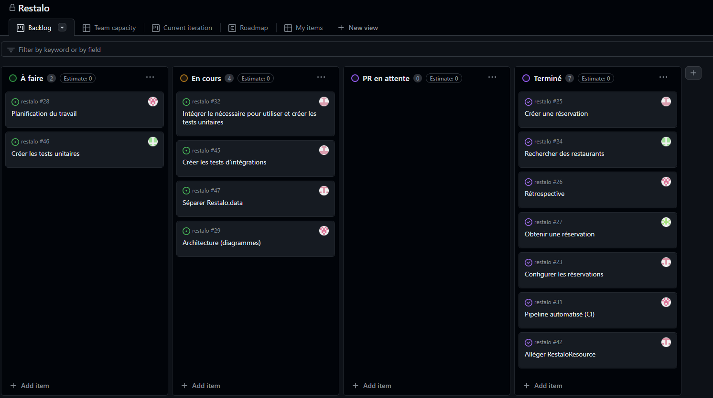

### Milestone

  
Capture d'écran

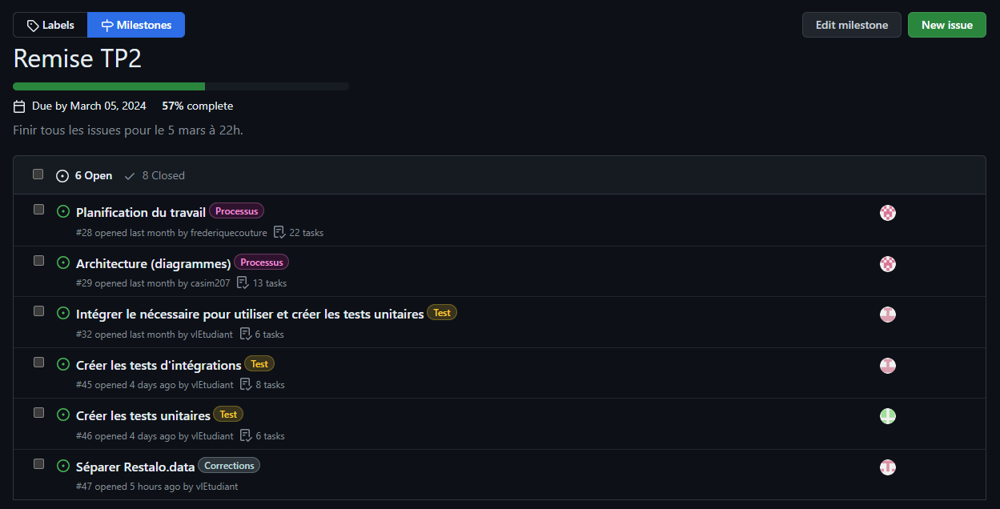

### Issues

  
Captures d'écran

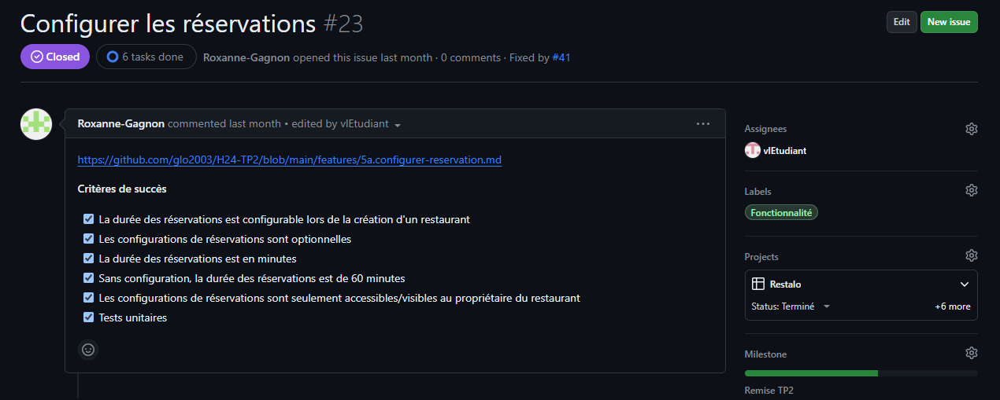
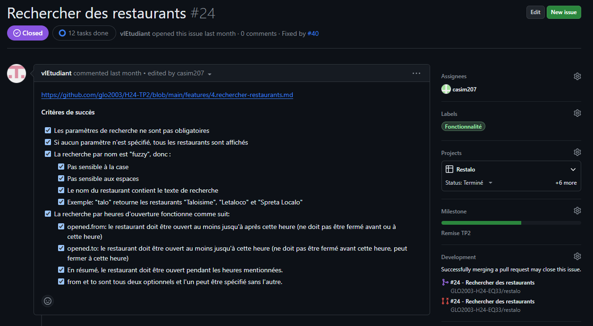
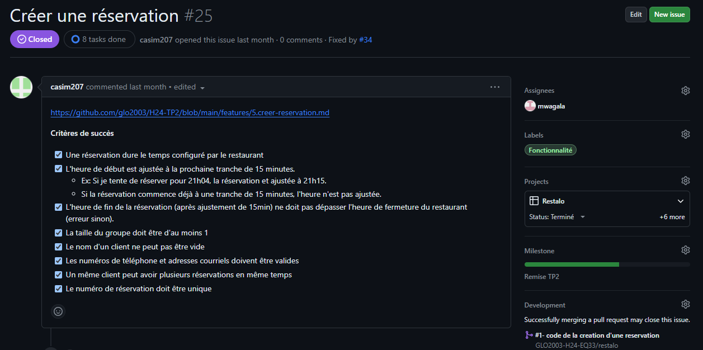

### Pull requests

  
Captures d'écran - Pull request 1

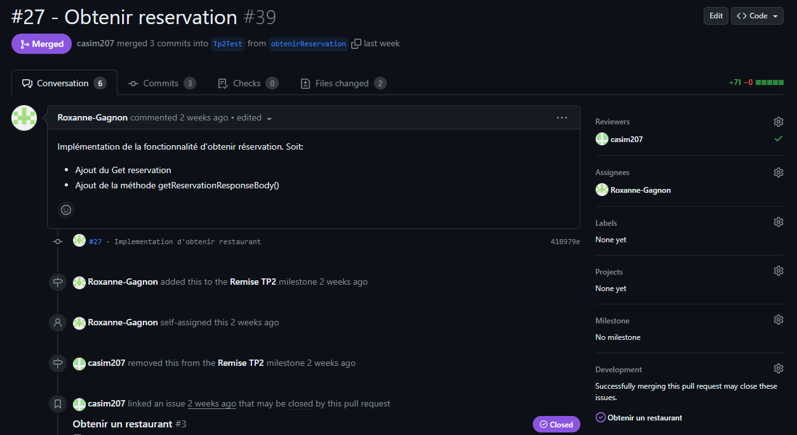
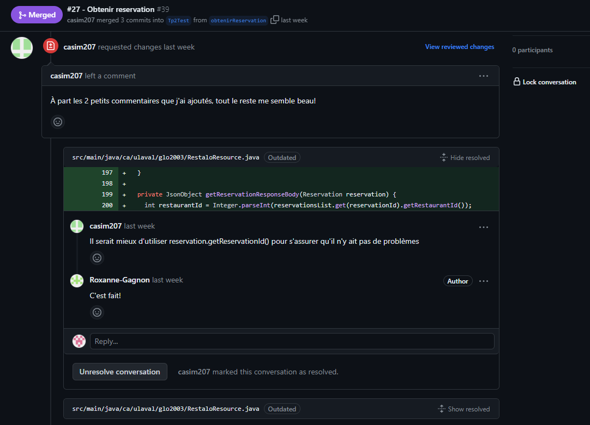

  
Captures d'écran - Pull request 2

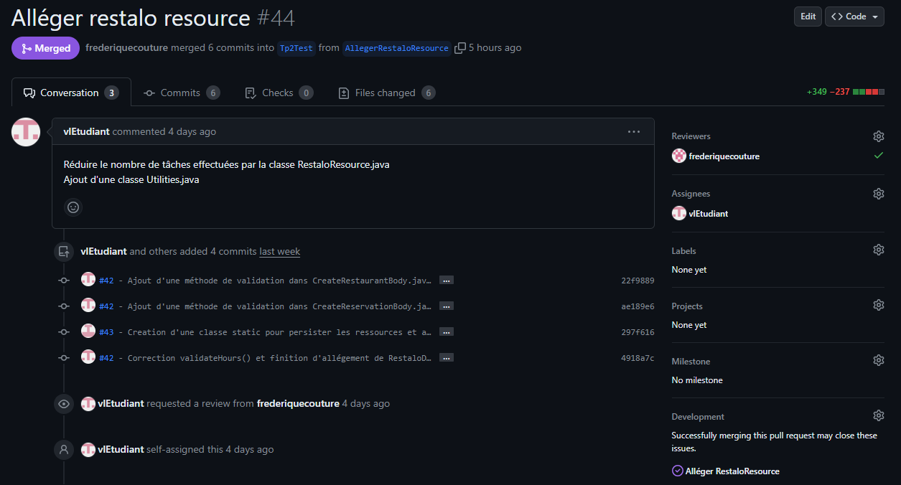
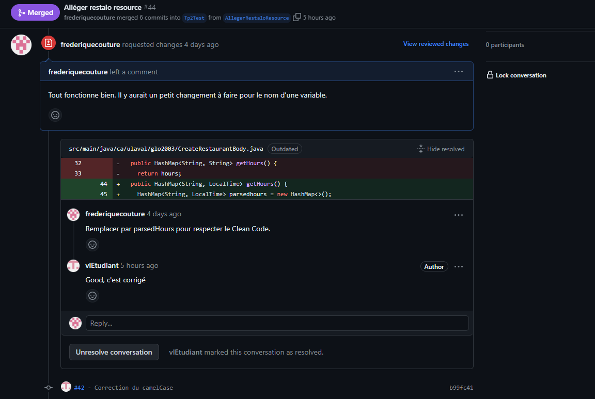

  
Captures d'écran - Pull request 3

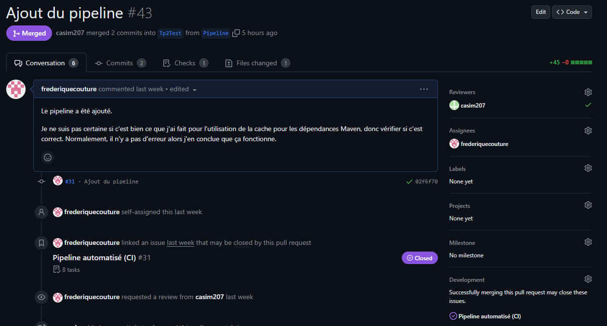
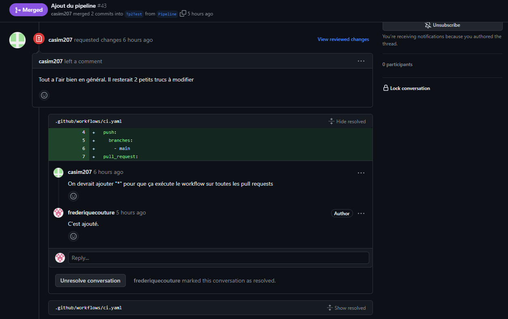

### Arbre de commits

  
Capture d'écran

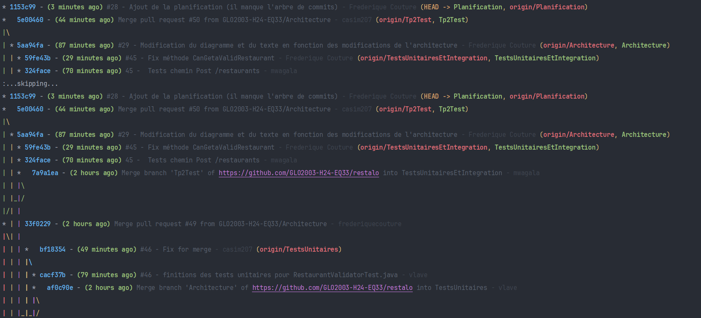

