# Exercices - TP3

## Rétrospective - Intégration continue et tests

### Pipeline CI

1. Avant l'implémentation du pipeline de tests automatisés, combien de temps passiez-vous à vérifier et tester manuellement le code lors des intégrations et des remises?
   - Nous passions de 15 à 30 minutes à vérifier et à tester manuellement le code lors des intégrations et des remises pour s’assurer de n’avoir rien brisé et de respecter tous les critères de succès et les exceptions.

2. Après l'implémentation du CI, combien de temps passiez-vous à faire ces vérifications?
   - Après l’implémentation du CI, nous passions seulement 1 à 2 minutes à faire ces vérifications, et cela correspond seulement au temps que le CI s’exécute et qu’on s’assure qu’il ne produise pas d’erreurs.

3. Quels sont les points positifs que le CI a apportés à votre processus? Donnez-en au moins 3.
   - Le CI a accéléré énormément la vérification (lors des intégrations et des remises). En effet, le CI s’occupe pour nous de vérifier que nous n’avons rien brisé en modifiant le code.
   - Le CI nous permet également de s’assurer que le code qu’on push sur les branches importantes (Tp2Test et main) est fonctionnel et qu’il ne contient pas d’erreurs qui l’empêcherait de build.
   - Le CI nous permet d’obtenir du feedback rapide quant aux problèmes potentiels qui se retrouvent dans notre code.
   - Le CI nous permet enfin de s’assurer que le formatage du code est conforme avec nos pratiques avant de le merge avec les branches importantes (Tp2Test et main).

4. Le pipeline CI amène-t-il un élément qui pourrait devenir négatif ou dangereux pour le processus, le produit et/ou l'équipe? Justifiez.
   - Le CI peut avoir tendance à donner une fausse impression de sécurité au développeur. On peut être tenté de dire que le code d’une pull request est valide car il a passé le CI, mais ce n’est pas toujours le cas. Si les tests ne couvrent pas tout le code ou ne le valident pas correctement, le CI ne détectera pas les erreurs. Même si un CI est en place, il faut continuer d’être rigoureux en matière de revues de code.

### Tests

1. Quelle proportion de temps passez-vous à faire l'implémentation du code fonctionnel par rapport à celui des tests? Est-ce que cette proportion évolue au fil du temps? Pourquoi?
   - Environ le même temps est passé à faire l’implémentation du code fonctionnel qu’à faire l’implémentation des tests. Cette proportion reste assez stable au fil du temps, puisque l’implémentation du code fonctionnel prend plus de temps en début de projet pour tout installer et va plus vite par la suite. C’est la même chose pour les tests, qui prennent plus de temps à mettre en place au début, mais qui peuvent se faire très rapidement par la suite, une fois que nous sommes habitués avec le processus. Évidemment, à la toute fin, la proportion de temps passée à implémenter les tests peut augmenter, puisqu’on peut faire plus de tests d’intégration et de tests système.

2. L'implémentation de tests augmente naturellement la charge de travail. Comment cela a-t-il affecté votre processus? (ex : taille des issues/PRs, temps d'implémentation, planification, etc.)
   - L’implémentation de tests dans notre projet a plus que doublé le nombre d’issues et ainsi de pull requests (car nous faisons une pull request par issue). En effet, nous avons ajouté 1 issue de tests unitaires par issue de fonctionnalité. Nous avons également ajouté 1 issue pour les tests d’intégration. La taille des issues et des pull requests en soi n’a donc pas augmenté, puisque nous avons simplement ajouté des issues et des pull requests.
   - Le temps d’implémentation d’une fonctionnalité a augmenté, puisqu’il comprend maintenant l’implémentation des tests. Par contre, le temps d’implémentation des issues de fonctionnalité n’a pas augmenté, puisque les tests correspondent à des issues à part entière.
   - La planification n’a pas vraiment changé, puisque nous avons décidé que la personne qui fait une issue de fonctionnalité doit également faire l’issue de tests unitaires et les tests d’intégration qui y sont associés.

3. Avez-vous plus confiance en votre code maintenant que vous avez des tests? Justifiez.
   - Oui, nous avons plus confiance en notre code maintenant que nous avons des tests, puisque nous sommes maintenant sûrs que s’il y a un changement dans le code qui brise l’application ou qui cause des erreurs, nous le saurons avant que le code contenant cette erreur soit mergé dans une des branches importantes (Tp2Test et main). De plus, les tests nous permettent de savoir l’erreur se situe exactement où dans le code et quelle est la différence entre la valeur attendue et la valeur réelle, ce qui nous permet de réparer l’erreur beaucoup plus facilement.

4. Que pouvez-vous faire pour améliorer l'état de vos tests? Donnez au moins 3 solutions.
   - Enlever les commentaires superflus (Act, Arrange, Assert)
   - Utiliser des fixtures dans nos tests
   - Utiliser plus de mocks pour rendre les tests moins interdépendants
   - Augmenter le nombre de tests pour avoir une meilleure couverture des exceptions

## Stories
### Epic: Consulter et gérer le menu des restaurants
1. Créer un item du menu d’un restaurant.

   - **Story** : En tant que restaurateur, je peux créer un nouvel item au menu d'un de mes restaurants.

   - **Critères de succès** :

      - Seul le propriétaire du restaurant peut ajouter un nouvel item au menu.

      - L’id doit être unique.

      - Le nom, la description et le prix ne peuvent pas être vides.

      - Le prix de l’item doit être d’au moins 1.
        

2. Supprimer un item du menu d’un restaurant

   - **Story** : En tant que restaurateur, je peux supprimer un item du menu d’un de mes restaurants.

   - **Critères de succès** :

      - Seul le propriétaire du restaurant peut supprimer un item du menu.

     - Le restaurant duquel le menu se trouve doit exister.

     - L’item doit être présent dans le menu.

3. Obtenir le menu d’un restaurant

   - **Story** : En tant que client, je peux obtenir le menu d’un restaurant.

   - **Critères de succès** :

      - Le restaurant duquel le menu se trouve doit exister.

4. Rechercher des items du menu d’un restaurant

   - **Story** : En tant que client, je peux rechercher des items du menu d’un restaurant.

   - **Critères de succès** :

     - Le restaurant duquel le menu se trouve doit exister.

     - On doit rechercher par un ou plusieurs des critères suivants : nom, prix (min, max).

     - La recherche par nom :

       - N'est pas sensible à la case.

       - N'est pas sensible aux espaces.

       - Le nom de l’item contient le texte de recherche.

     - La recherche par prix peut contenir :

       - Un minimum

         - Doit être plus grand que 0.
         - Doit être plus petit ou égal au maximum s'il est présent.

       - Un maximum

         - Doit être plus grand que 0.
         - Doit être plus grand ou égal au minimum s'il est présent.

## Architecture

  
Diagramme

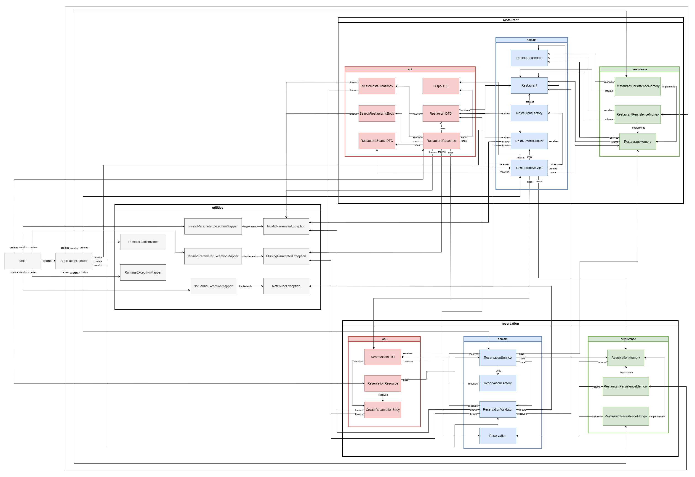

### Rôles des classes principales

La classe _RestaurantResource_ permet de faire la gestion des restaurants dans la couche API. Pour ce faire, elle fait
appel à la classe _RestaurantService_, qui permet d’exécuter les différentes actions liées à la gestion des restaurants. À
son tour, la classe _RestaurantService_ utilise la classe _RestaurantValidator_ pour valider les informations lors de la
création d’un restaurant et utilise l’interface _RestaurantMemory_ qui définit un ensemble de méthodes pour sauvegarder
les restaurants. De plus, la classe _RestaurantPersistenceMongo_ implémente l'interface _RestaurantMemory_ et elle utilise
une base de données MongoDB afin de stocker les données des restaurants. Pour sa part, la classe
_RestaurantPersistenceMemory_ implémente également l’interface _RestaurantMemory_, mais enregistre plutôt les données des
restaurants en local.

Pour ce qui est de la classe _ReservationResource_, elle s’occupe de la gestion des réservations. Sa structure est
similaire à celle de _RestaurantResource_. En effet, elle fait appel à la classe _ReservationService_, qui utilise
_ReservationValidator_ et _ReservationMemory_ pour des opérations similaires à celles de _RestaurantValidator_ et
_RestaurantMemory_, mais pour les réservations. Tout comme _RestaurantPersistenceMongo_, la classe
_ReservationPersistenceMongo_ implémente l'interface _ReservationMemory_ et stocke les données des réservations dans une
base de données MongoDB. La classe _ReservationPersistenceMemory_ implémente également _ReservationMemory_, mais stocke pour
sa part les données en local.

Finalement, les classes _RestaurantFactory_ et _ReservationFactory_, utilisées dans la couche du domaine, permettent de
créer des instances des classes _Restaurant_ et _Réservation_.

### Explication de nos choix

Nous avons choisi de diviser nos packages en modules ainsi qu’en couches afin d’avoir une meilleure encapsulation et une
séparation plus claire entre les fonctionnalités des restaurants et des réservations. Chaque module a sa propre logique
interne et ses dépendances spécifiques, ce qui facilite la gestion du code. À l’intérieur de ces packages, nous avons
également divisé les classes en fonction des couches API, domaine et de persistance afin de mieux répartir les
responsabilités des classes. Les classes du domaine, telles que _RestaurantValidator_ et _ReservationValidator_, sont
responsables de la logique et de la manipulation des données, tandis que les classes de l’API, comme _RestaurantResource_
et _ReservationResource_, sont responsables de gérer les requêtes HTTP. Enfin, les classes et interfaces de la couche de
persistance, telles que _RestaurantMemory_ et _ReservationMemory_, sont responsables de l’accès aux données et de la
sauvegarde des données des restaurants et des réservations. Cette approche choisie permet d’avoir une organisation
structurée et cohérente du code.

### Solutions potentielles

Pour ce qui est des relations suspectes, nous avons remarqué que la classe _RestaurantService_ communique directement avec
_ReservationMemory_ et que la classe _ReservationService_ communique aussi directement avec _RestaurantMemory_, ce qui
pourrait être considéré comme une relation suspecte. En effet, cette relation entraîne un fort couplage entre les deux
modules. Pour résoudre ce problème, il serait préférable que la communication entre les modules se fasse seulement entre
les classes _ReservationService_ et _RestaurantService_ pour les opérations liées aux réservations et aux restaurants
respectivement. Cela permettrait donc d’avoir une meilleure modularité en réduisant le couplage entre les modules.

## Planification du travail

### Github Project

  
Capture d'écran

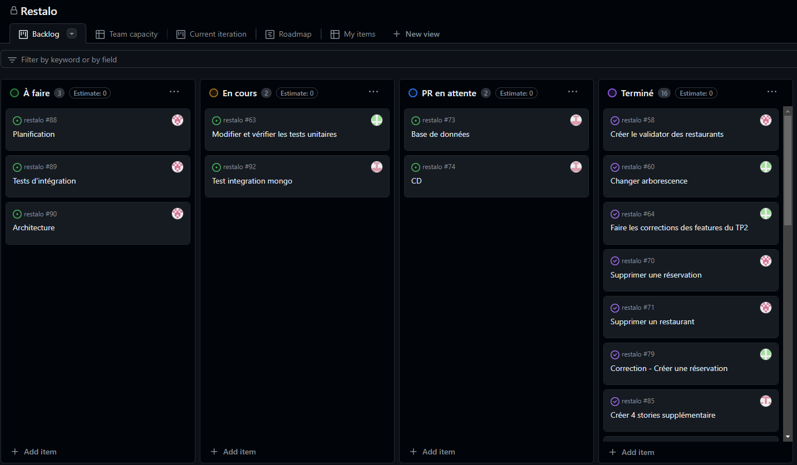

### Milestone

  
Capture d'écran

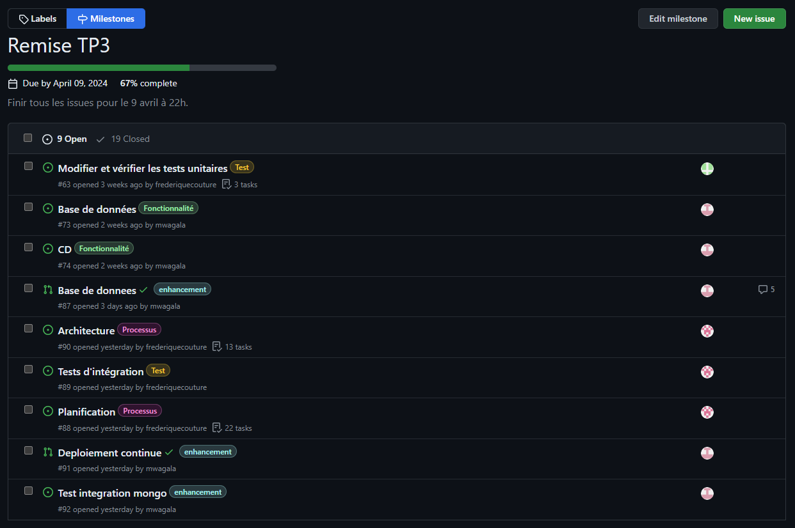

### Issues

  
Captures d'écran

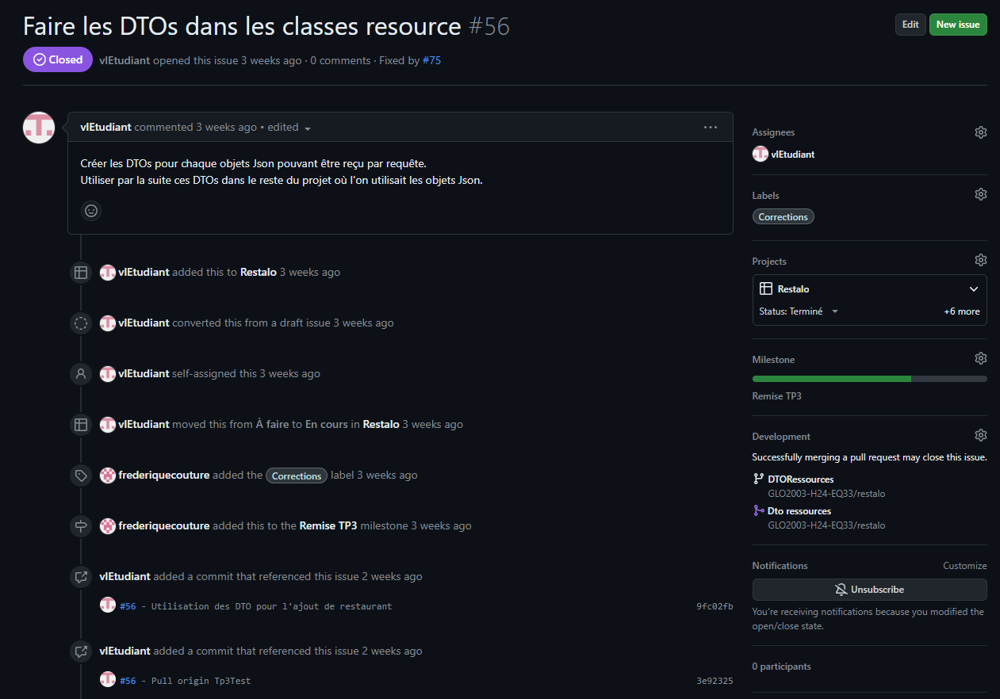
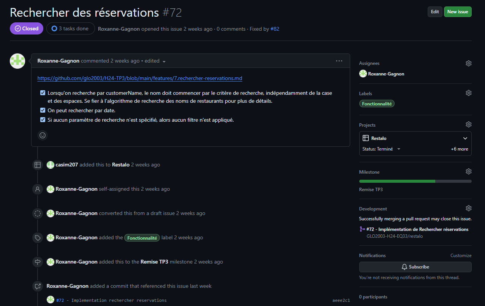
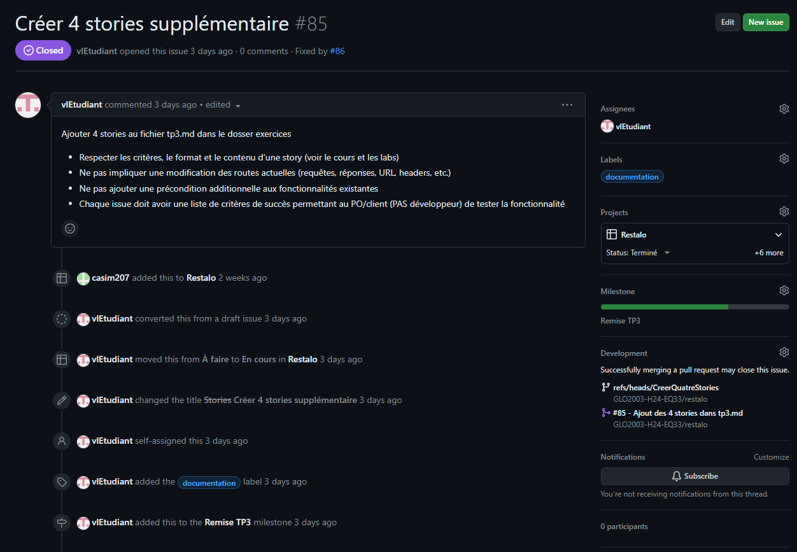

### Pull requests

  
Captures d'écran - Pull request 1

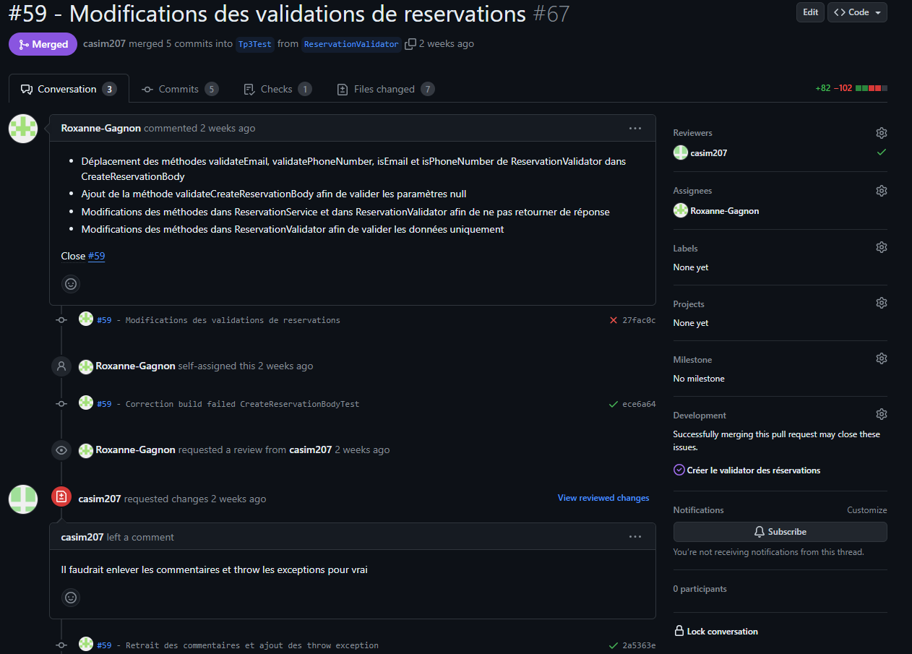

  
Captures d'écran - Pull request 2

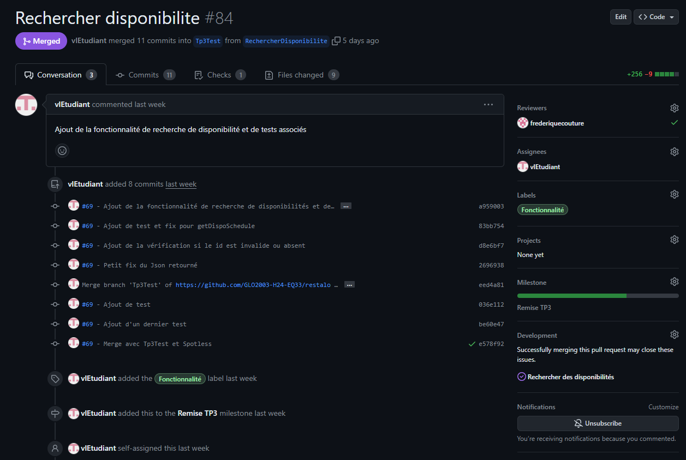
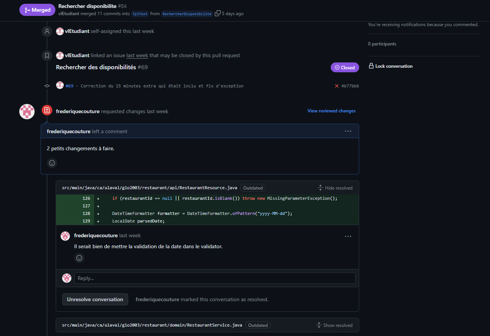

  
Captures d'écran - Pull request 3

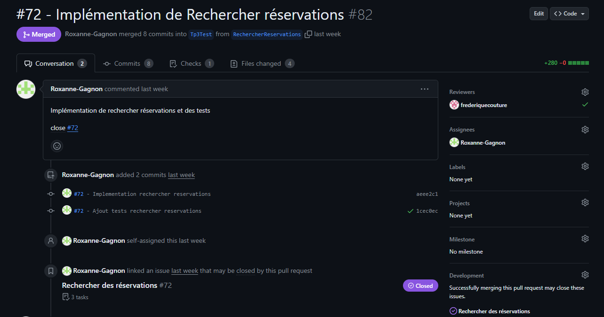
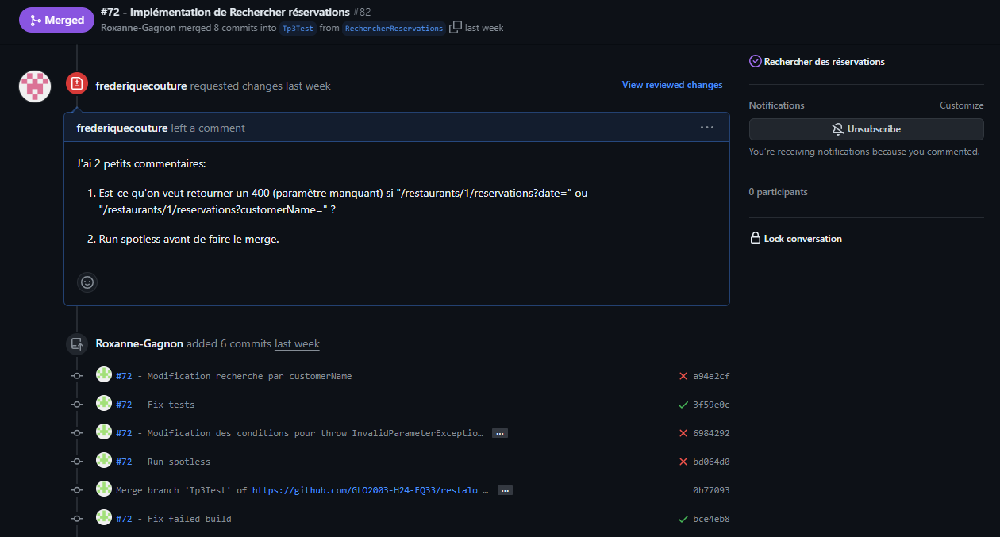

### Arbre de commits

  
Capture d'écran

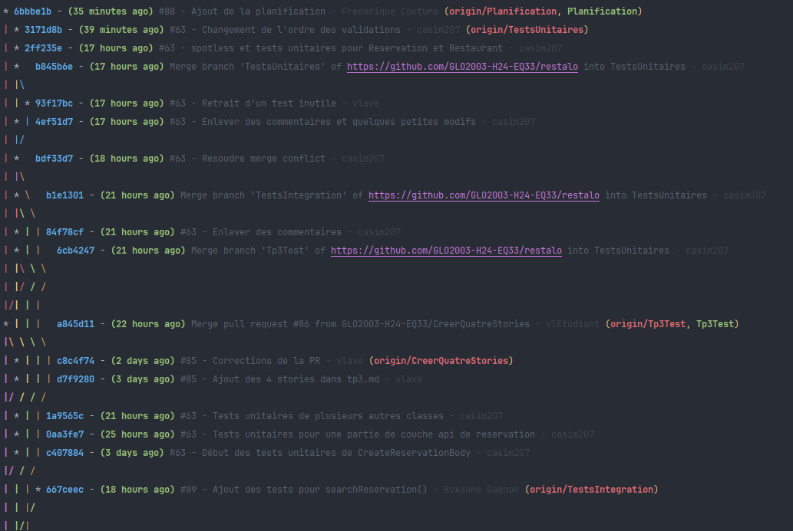

